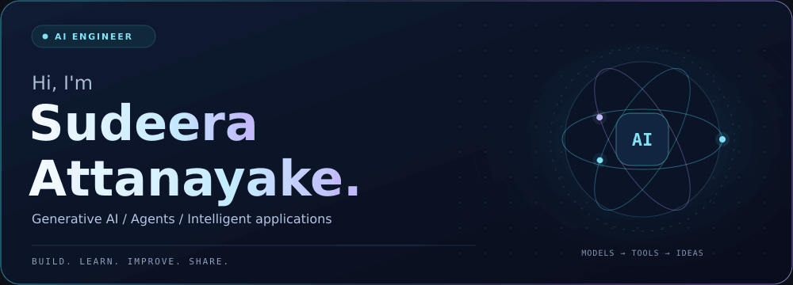

<!-- CUSTOM ANIMATED BANNER -->
<!-- Upload banner.gif to the same folder as README.md. -->

  

<!-- ANIMATED INTRODUCTION -->

  

  <strong>Turning ideas into useful AI applications, one experiment at a time.</strong>

  

  <a href="#about-me">About me</a>
  &nbsp; • &nbsp;
  <a href="#languages">Languages</a>
  &nbsp; • &nbsp;
  <a href="#ai-and-data">AI & Data</a>
  &nbsp; • &nbsp;
  <a href="#frameworks-and-libraries">Frameworks</a>
  &nbsp; • &nbsp;
  <a href="#currently-exploring">Learning</a>

---

## About me

I'm **Sudeera Attanayake**, an **AI engineer and software engineering student** interested in building practical applications with artificial intelligence.

- 🤖 **Building** single-agent and multi-agent applications with Python and LangChain.
- 🧩 **Exploring** LangGraph, state management, and conditional workflows.
- 🧠 **Developing my skills** in PyTorch, transformers, and large language models.
- 📚 **Learning** retrieval-augmented generation, embeddings, and vector databases.
- 🎓 **Studying** for an HND in Software Engineering at ESOFT Metro Campus.
- 🤝 **Interested in** learning together and collaborating on AI applications.

> Build with curiosity. Learn through practice. Improve with every iteration.

---

## Languages

  
  
  
  
  
  
  

## AI and Data

  
  
  
  
  
  
  
  

## Frameworks and Libraries

  
  
  
  

## Developer Tools

  
  
  
  
  

---

## Currently Exploring

  

| Focus | What I'm exploring |
| :--- | :--- |
| 🤖 **Agentic AI** | Tool calling, memory, and coordinated agent workflows |
| 🧩 **LangGraph** | State, conditional routing, and workflow orchestration |
| 📚 **RAG** | Embeddings, vector search, and grounded responses |
| 🧠 **Deep Learning** | Neural networks, model training, and transformers |
| 🌐 **AI Applications** | Connecting models to useful, accessible interfaces |

---

  <strong>Curiosity → Learning → Building → Improving</strong>

  

  

<!-- The custom banner requires banner.gif in this repository. -->
<!-- Typing animations, badges, and the footer use external image services. -->
